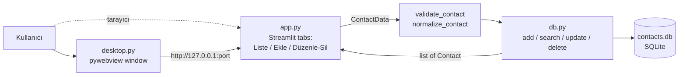

# Adres Defteri (Streamlit + SQLite)

Basit contact CRUD uygulaması: listele/ara, ekle, düzenle, sil. Veri `contacts.db` (SQLite) dosyasında, ilk çalıştırmada otomatik oluşur.

## Çalıştırma

```bash
git clone https://github.com/farukcan/addressbook_streamlit.git
cd addressbook_streamlit
uv sync
uv run streamlit run app.py   # tarayıcıda
uv run python desktop.py      # native pencerede (pywebview)
uv run pytest
```

## Yapı

- `db.py` — SQLite data access (schema, validation, CRUD).
- `app.py` — Streamlit UI; her rerun'da yeni connection açar, işlem sonrası `st.rerun()` ile tüm sekmeleri tazeler.
- `desktop.py` — desktop launcher: Streamlit'i `127.0.0.1` üzerinde boş bir port'ta subprocess olarak başlatır, health check sonrası pywebview penceresinde açar; pencere kapanınca server'ı durdurur.
- `test_db.py` — `db.py` testleri.



## Güvenlik

- Uygulamada authentication yok. `.streamlit/config.toml` server'ı `localhost`'a bind eder; `desktop.py` de `127.0.0.1` kullanır. Ağa açmayın.
- `contacts.db` kişisel veri içerir ve `.gitignore`'dadır; secret'lar için `.streamlit/secrets.toml` / `.env` de ignore edilir.

## Bilinen kısıt

Arama SQLite `LIKE` kullanır; case-insensitive eşleşme yalnızca ASCII harflerde çalışır (`istanbul` ≠ `İstanbul`).

## License

MIT — bkz. [LICENSE](LICENSE).
