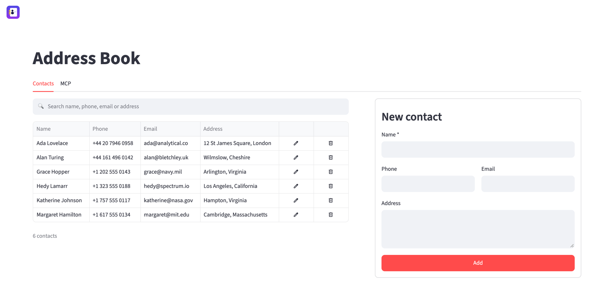
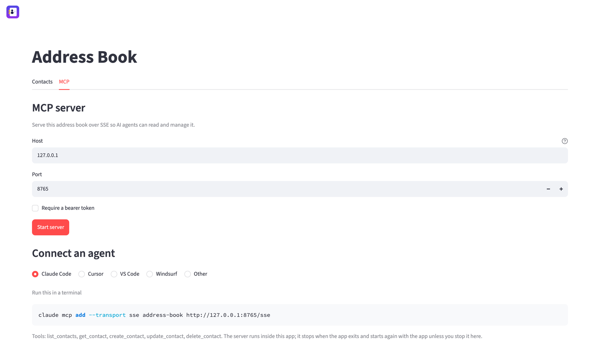
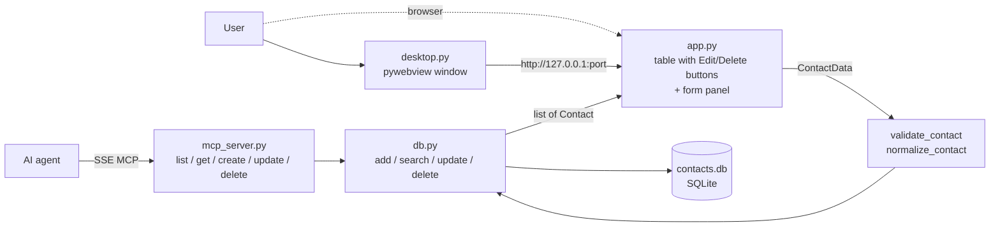

# Address Book (Streamlit + SQLite)

A simple contact CRUD app: search, add, edit and delete contacts. Data lives in a local SQLite file (`contacts.db`), created on first run. An optional SSE MCP server exposes the same contacts to AI agents.





The screenshots show sample data, not a real address book.

## Run

```bash
git clone https://github.com/farukcan/addressbook_streamlit.git
cd addressbook_streamlit
uv sync
uv run streamlit run app.py   # in the browser
uv run python desktop.py      # in a native window (pywebview)
uv run pytest
```

[FEATURES.md](FEATURES.md) lists what the app does today as a walk-through for testing it by hand.

## Structure

- `db.py` — SQLite data access (schema, validation, CRUD).
- `app.py` — Streamlit UI: search + table on the left, form panel on the right. Each row has Edit and Delete buttons (`st.column_config.ButtonColumn`). Edit loads the contact into the panel by id; Delete opens a confirmation dialog (`st.dialog`). With nothing being edited the panel shows the new-contact form.
- `desktop.py` — desktop launcher: starts Streamlit as a subprocess on a free port on `127.0.0.1`, waits for the health check, opens a pywebview window and stops the server when the window closes.
- `mcp_server.py` — SSE MCP server exposing `list_contacts`, `get_contact`, `create_contact`, `update_contact` and `delete_contact`. It runs in a background thread of the Streamlit process, started and stopped from the MCP tab; every tool call opens its own SQLite connection.
- `live_update.py` — makes open browser sessions rerun after a write from the MCP server, so an agent's change shows up in the UI at once. Streamlit has no public API for a rerun triggered outside a script run, so this uses the runtime's session manager; `test_live_update.py` fails if an upgrade renames that private API.
- `test_db.py`, `test_mcp_server.py`, `test_app.py`, `test_live_update.py` — tests, including an end-to-end run where an MCP client connects over SSE and manages contacts, and Streamlit `AppTest` runs of the UI.
- `make_logo.py` — draws `assets/logo-512.png` and `assets/logo-128.png` procedurally with Pillow (no image files to maintain); the app uses the small one as its page icon.
- `.streamlit/config.toml` — production settings: developer toolbar and Deploy button hidden (`toolbarMode = "minimal"`), no tracebacks in the UI (`showErrorDetails = "none"`, details go to the console), file watcher off. Streamlit reads this file from the working directory; `desktop.py` starts the subprocess in the project directory.



## MCP server

The MCP tab starts and stops an SSE MCP server and shows the configuration to copy for the Claude Code CLI, Cursor (`~/.cursor/mcp.json`), VS Code (`.vscode/mcp.json`), Windsurf (`~/.codeium/windsurf/mcp_config.json`) and other clients, since they differ in the file they read and in the key that carries the URL. With the Claude Code CLI, for example:

```bash
claude mcp add --transport sse address-book http://127.0.0.1:8765/sse
```

Host, port and an optional bearer token are set in that tab. The token is off by default; when it is on, requests need `Authorization: Bearer <token>` and anything else gets 401.

The server lives in the Streamlit process, so it stops when the app exits. A running server is recorded in `mcp_state.json` (git-ignored, owner-readable only, since it holds the token) and started again with the app, so closing the app without pressing Stop resumes the server on the next launch. Stop deletes the record. If the restart fails, for example because the port is taken, the MCP tab shows why and the app stays usable.

## Security

- Binding the MCP server to anything other than `127.0.0.1` exposes full read/write access to the contacts. Turn the token on before doing that.
- The app has no authentication. `.streamlit/config.toml` binds the server to `localhost` and `desktop.py` uses `127.0.0.1`. Do not expose it to a network.
- `contacts.db` holds personal data and is git-ignored, as are `.env` and `.streamlit/secrets.toml` for secrets.

## Known limitation

Search uses SQLite `LIKE`, whose case-insensitive matching only works for ASCII letters (`café` does not match `CAFÉ`).

## License

MIT — see [LICENSE](LICENSE).
