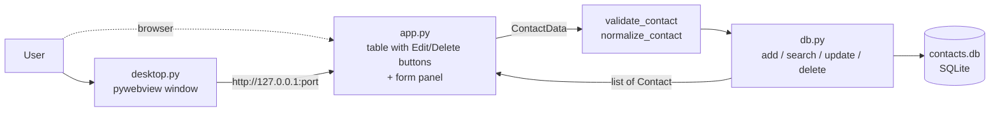

# Address Book (Streamlit + SQLite)

A simple contact CRUD app: search, add, edit and delete contacts. Data lives in a local SQLite file (`contacts.db`), created on first run.

## Run

```bash
git clone https://github.com/farukcan/addressbook_streamlit.git
cd addressbook_streamlit
uv sync
uv run streamlit run app.py   # in the browser
uv run python desktop.py      # in a native window (pywebview)
uv run pytest
```

## Structure

- `db.py` — SQLite data access (schema, validation, CRUD).
- `app.py` — Streamlit UI: search + table on the left, form panel on the right. Each row has Edit and Delete buttons (`st.column_config.ButtonColumn`). Edit loads the contact into the panel by id; Delete opens a confirmation dialog (`st.dialog`). With nothing being edited the panel shows the new-contact form.
- `desktop.py` — desktop launcher: starts Streamlit as a subprocess on a free port on `127.0.0.1`, waits for the health check, opens a pywebview window and stops the server when the window closes.
- `test_db.py` — tests for `db.py`.
- `.streamlit/config.toml` — production settings: developer toolbar and Deploy button hidden (`toolbarMode = "minimal"`), no tracebacks in the UI (`showErrorDetails = "none"`, details go to the console), file watcher off. Streamlit reads this file from the working directory; `desktop.py` starts the subprocess in the project directory.



## Security

- The app has no authentication. `.streamlit/config.toml` binds the server to `localhost` and `desktop.py` uses `127.0.0.1`. Do not expose it to a network.
- `contacts.db` holds personal data and is git-ignored, as are `.env` and `.streamlit/secrets.toml` for secrets.

## Known limitation

Search uses SQLite `LIKE`, whose case-insensitive matching only works for ASCII letters (`café` does not match `CAFÉ`).

## License

MIT — see [LICENSE](LICENSE).
